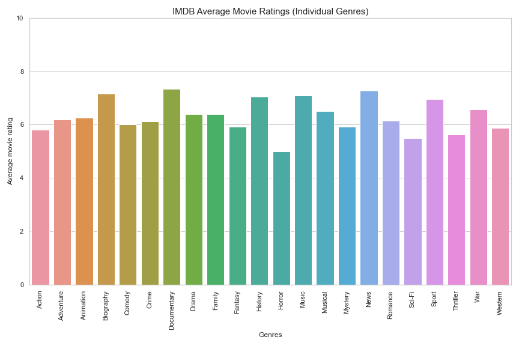
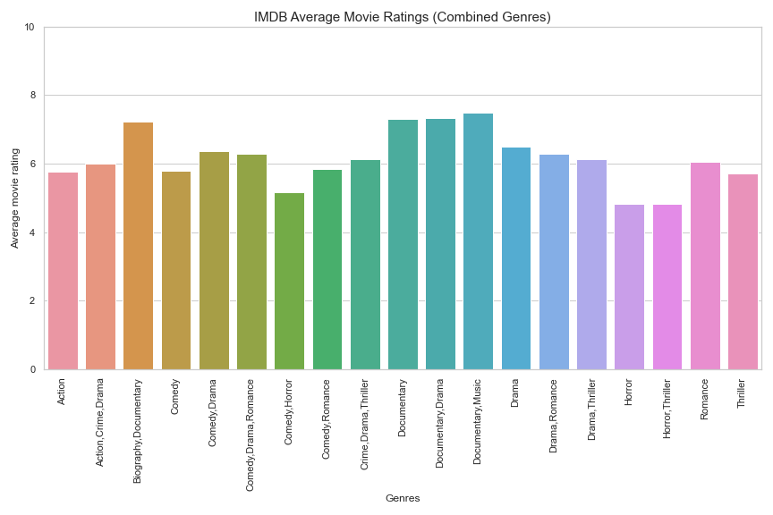
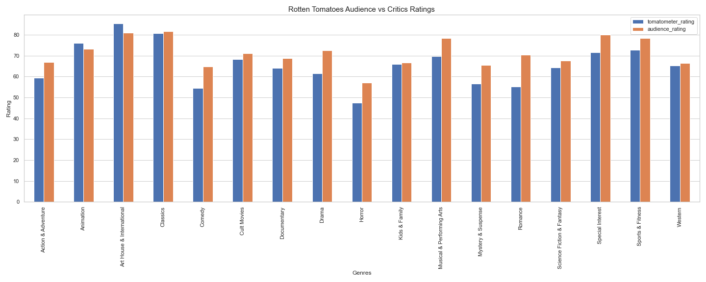
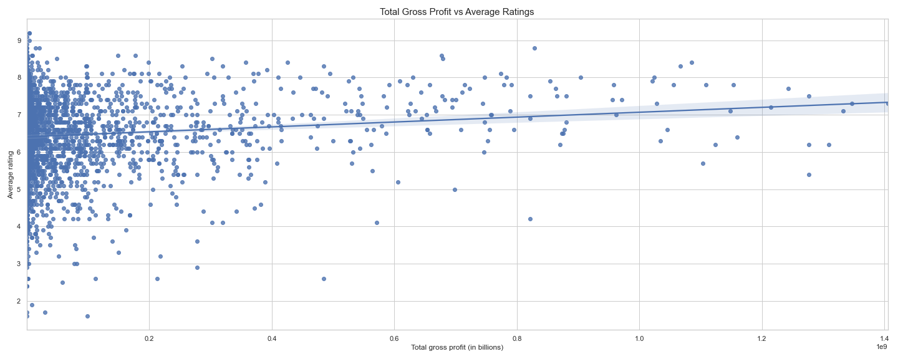

# An Insight On Success In Movie Production

**Authors**: Nancy Ho

## Overview

To stay on par with its tech industry competitors, Microsoft has decided to open a movie studio, but doesn't know where to start. In this project, I use data from movie databases such as IMDB and Box Office Mojo to analyze the elements of successful movies. By highlighting movie genres that are well-received and those that also make significant profits, I provide insights as to the possible routes Microsoft can take to flourish in movie production.

## Business Problem

As online streaming grows in popularity, you see more platforms being introduced by the day, some of them including Amazon Prime and Apple TV. These streaming platforms promise original content, most notably movies, and have been widely successful. In response to this boom, Microsoft has finally decided to make the move towards movie production as well to start out. However, it can be difficult to figure out what to do from there, but through meaningful analyses of the movie industry, we can gain a general direction of where to go.

In order to start off on the right foot, it's important to answer the question: **"What is a successful movie?"** From a business perspective, something is successful when it **turns a significant profit for the company**. Therefore, a successful movie at its core is a movie that generates a significant profit that offsets expenses from casting, production, etc. In addition, I would like to argue that **high ratings** are also an important factor to a movie's success; by creating a reputation for yourselves in the movie market, you can keep customers coming back to your movies for years to come.

In this analysis, we will be looking at data from movie databases while trying to answer these questions:

- Which kinds of movies generate the most profit?
- Which movies are best received by moviegoers (and critics)?
- Is there a significant relationship between profits and ratings?

Being able to answer these questions through data cleaning and visualization will enable Microsoft to make informed decisions on movie production and take steps towards making a presence for themselves in this industry.

## Data

For this project, I used tables from a larger SQL database, movies.db, that contains datasets from movie databases including IMDB, Box Office Mojo, and Rotten Tomatoes. Although the database includes other sources for movie data, for this analysis I only use data from those  sites. The specific datasets I chose for my analysis contain information about movie gross profits domestic and overseas as well as average ratings for those movies among critics and moviegoers.

## Methods

To create the datasets I used in my analysis, I use SQL queries to join tables from movies.db database to ensure that my datasets only contain the most relevant data to my analysis, instead of going through each table individually to drop unnecessary columns. Then I store the data I called with those SQL queries in Pandas dataframes and clean them as necessary. I then use descriptive analysis to point out trends in the data that provides helpful suggestions for Microsoft to start with better ideas on how they can make successful movies.

## Results

Present your key results. For Phase 1, this will be findings from your descriptive analysis.

***
Questions to consider:
* How do you interpret the results?
* How confident are you that your results would generalize beyond the data you have?
***

Here is an example of how to embed images from your sub-folder:

### Gross Profits
When comparing the total gross profits across individual movie genres, it seems that in both domestic and foreign box offices, Adventure, Animated and Sci-Fi movies perform the best and return the most profit.


### Average Movie Ratings
In contrast, higher-grossing genres aren't as favorable with audiences as others, and genres that tend to be non-fictional like Documentary, History, and News tend to have higher ratings overall. This is also the case with combinations of the highest rated genres, such as the Biography, Documentary and Documentary, Music genres.




### Critics vs Audience Ratings
On Rotten Tomatoes ratings, however, Documentary films aren't rated as favorably as on IMDB. Instead, the highest rated genre is Art House & International, which is used to classify films aimed at niche, smaller demographics rather than the mass of moviegoers. As such, these movies are often praised for unique elements that set them above other broader genres, which might explain their high ratings, particularly among critics.

Another notable observation is that while audience ratings tend to be similar to critics', there are some genres that perform better among audiences than critics, such as Comedy, Horror, and Romance. This may be because audience ratings on Rotten Tomatoes are more based on entertainment value than critics' reviews, which focus more on details and structure within a movie.


### Gross Profits vs Average Ratings
"Successful" and "good" are positive connotations to describe movies, and are often used synchronously. However, it seems there is a positive yet weak correlation between gross profits and average movie ratings. While there are other factors that influence a movie's gross profit, we can make a distinction between a "successful" movie and a "good" movie; just because a movie is high-grossing doesn't necessarily mean it's good, and vice versa.


## Conclusions

Based on the results of the analysis, these are the main recommendations I would make to Microsoft:
- **Focus on quality over quantity.** While rating may not be a strong determinant of a movie's success, in order to promote growth and set the audience's expectations and anticipation high for your future works, it is important to make movies of high quality that, at the same time, will turn profits. 
- **Combine genre elements in the premises for your first movies.** For instance, you could produce an sci-fi film based on historical events and include unique elements to keep the audience's attention.
- For now, **keep production budgets low while focusing on quality**. Although we didn't have the chance to look at the production budgets of successful movies, in general when starting out as a movie producer, it shouldn't be necessary to utilize a large budget that will be hard to make up later in the box office. One way you can go about doing this is hiring newer, up and coming staff members when producing your first movies.

While this analysis provides a basic foundation on where to start producing movies by showing which movies perform better than others, there are other variables that go into a movie's success beyond the scope of what can be captured by data, and have not been fully explored here. Going forward, it's important to be aware of the limitations set by being a newer movie production company and making decisions while weighing the risks versus returns of venturing into movie production.

In the future, Microsoft would benefit from further analysis of other aspects of movies such as:
- **Production budgets of successful and unsuccessful movies** so they can come up with a better estimate of how much it would cost to produce a high quality movie.
- **The impact of certain well-known directors and/or actors on movie success**. 
- **Certain characteristics of high-rating movie reviews** to be able to create a script and set standards during movie production based on specific elements that critics and audience members favor in highly-rated movies.

## For More Information


Please review the full analysis in the [Jupyter Notebook](/microsoft-movie-analysis-code.ipynb) or the [presentation](/Microsoft_Movie_Ana

For any additional questions, please contact **Nancy Ho** at [nancyho83@yahoo.com].

## Repository Structure

```
├── README.md                             <- The top-level README for reviewers of this project
├── microsoft-movie-analysis-code.ipynb   <- Narrative documentation of analysis in Jupyter notebook
├── Movie_Analysis_Presentation.pdf       <- PDF version of project presentation
├── data                                  <- Both sourced externally and generated from code
└── images                                <- Both sourced externally and generated from code
```